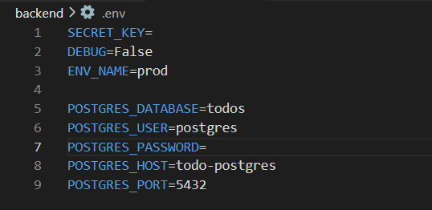
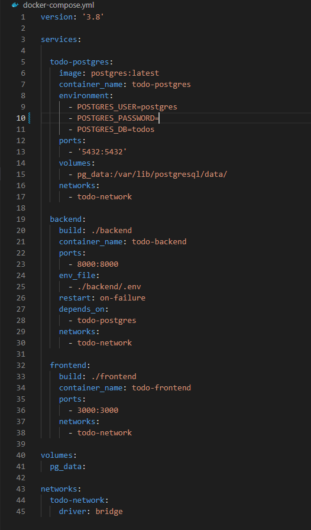

# TODO APP

A simple todo app to track your tasks. Users can register and login to the site, add numerous tasks, edit or delete them later or sort them by updated or created date.

## Tech Stack

**Frontend:** Next.js

**Backend:** Django

**Database:** PostgreSQL

**Cloud:** Docker

## Authors

- [@ahmetyazgan - 40316](https://github.com/AhmetYazgan)
- [@burakates - 41286](https://github.com/BurakCanAtes)

## How to Run the Application in Your Device

First, clone the repository:

```bash
git clone https://github.com/AhmetYazgan/todo-app.git
```

After cloning repository, create a file inside of backend directory named ".env".

.env file must include the variables from image below:


SECRET_KEY can be generated randomly or from online web sites.

DEBUG must be False and ENV_NAME must be prod. Otherwise application won't run correctly.

POSTGRES_DATABASE is the name of the database that will be created in postgresql.

POSTGRES_USER is the name of the owner of the database.

POSTGRES_PASSWORD is the password of postgresql database.

POSTGRES_HOST must be same with the name of the database service in docker-compose.yml. It'll be mentioned again later.

POSTGRES_PORT is the port name that the postgresql use to host the application. Default: 5432.

After creating the .env file, docker-compose.yml file should be edited.


On line 5, service name must be same with the POSTGRES_HOST variable from .env file.

On line 9, POSTGRES_USER variable must be same with the POSTGRES_USER from .env file.

On line 10, POSTGRES_PASSWORD variable must be same with the POSTGRES_PASSWORD from .env file.

On line 11, POSTGRES_DB variable must be same with the POSTGRES_DATABASE from .env file.

If default port(5432) will not be used, ports option must be changed as: [port_name]:5432. Same thing applies for frontend and backend ports.

When the configuration completed, open your terminal and run:

```bash
docker-compose up -d --force-recreate
```

3 containers for database, backend and frontend will be up and running after build.

But the application won't work, because the database is not ready yet.

Go to backend dir and create your database schemas:

```bash
cd backend
docker-compose exec backend python manage.py migrate
```

After migrations applied, the application is now available on [http://localhost:3000](http://localhost:3000) (If it is not changed in Dockerfile or docker-compose).
